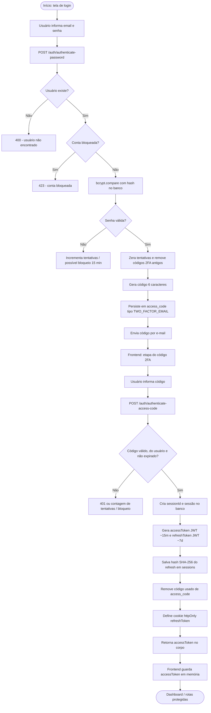
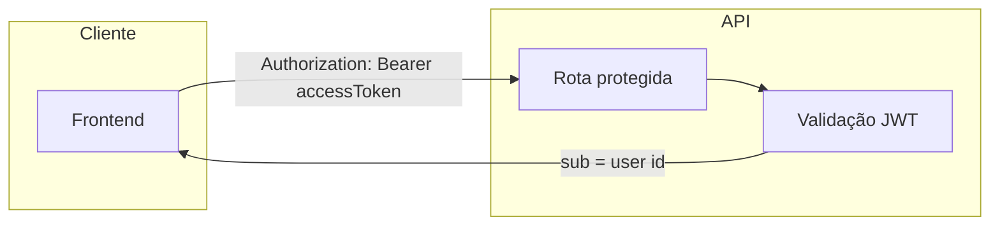
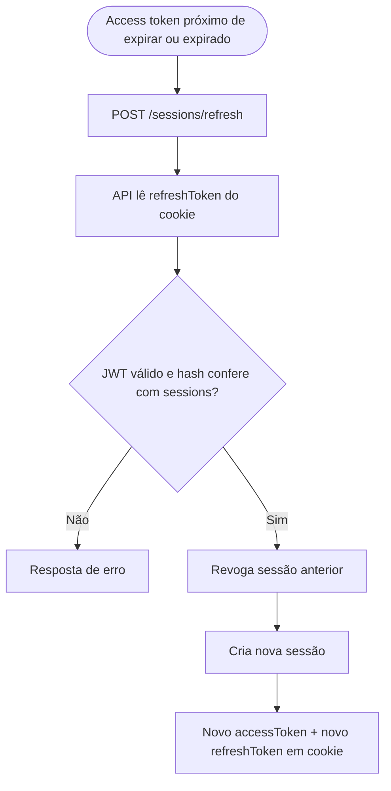
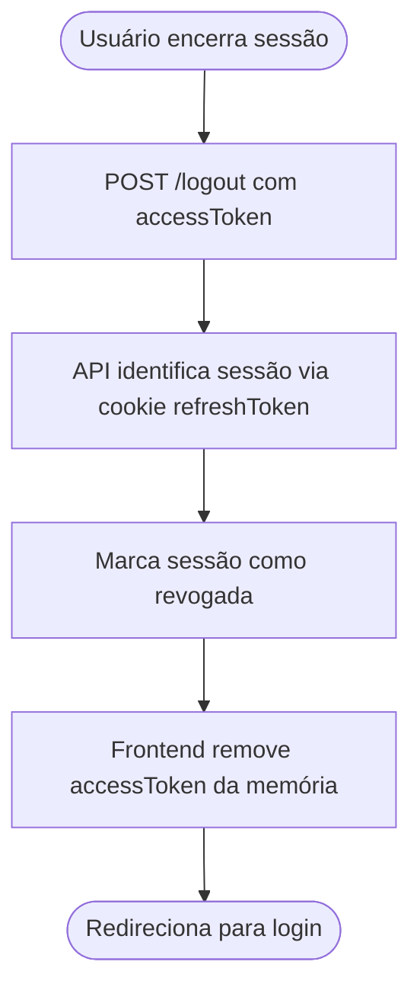
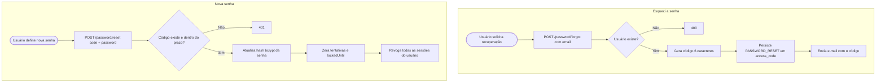

# Fluxo de autenticação

Documentação visual do fluxo de identidade do projeto UMC Segurança: login em duas etapas (senha + 2FA por e-mail), sessão com JWT de acesso e refresh em cookie `httpOnly`, renovação, logout e recuperação de senha.

Os diagramas usam [Mermaid](https://mermaid.js.org/) (`flowchart`). Em editores compatíveis (GitHub, GitLab, VS Code com extensão Mermaid), eles são renderizados automaticamente.

---

## Visão geral: do login à sessão ativa

---

## Requisições autenticadas e exemplo de perfil

Exemplo documentado no projeto: `GET /sessions/me` com o cabeçalho `Authorization: Bearer <accessToken>`.

---

## Renovação do access token

---

## Logout

---

## Recuperação de senha (fluxo paralelo ao login)

Independente do 2FA de login; usa `access_code` com tipo `PASSWORD_RESET` e TTL configurável (`PASSWORD_RESET_TTL_MIN`, ex.: 60 minutos).

---

## Referência rápida de endpoints

| Etapa | Método e caminho |
|-------|------------------|
| 1ª etapa login | `POST /auth/authenticate-password` |
| 2ª etapa login (2FA) | `POST /auth/authenticate-access-code` |
| Perfil autenticado | `GET /sessions/me` |
| Renovar tokens | `POST /sessions/refresh` |
| Encerrar sessão | `POST /logout` |
| Solicitar reset | `POST /password/forgot` |
| Confirmar nova senha | `POST /password/reset` |

Para detalhes em texto e números (tentativas, bloqueio, TTL do código 2FA), consulte o `README.md` na raiz do repositório.
