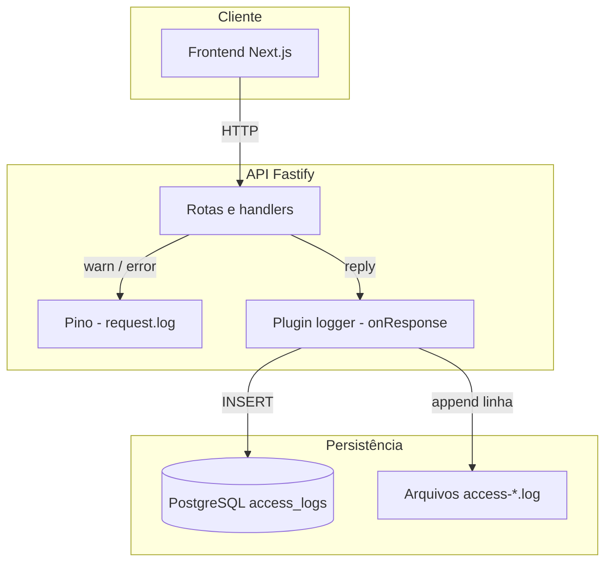
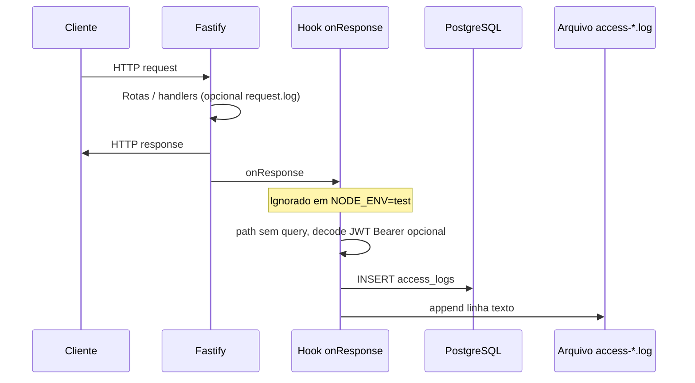

# Fluxo de logs na aplicação

Este documento descreve **onde**, **quando** e **para que** os logs são gerados no projeto UMC Segurança, com foco na API (`server`). O frontend Next.js **não** implementa um pipeline de logs estruturado equivalente; a rastreabilidade de acessos fica concentrada no backend.

---

## Visão geral em camadas

A aplicação combina três ideias distintas de “log”:

| Camada | Tecnologia | Quando atua |
|--------|------------|-------------|
| Log da framework (HTTP / erros) | Fastify + **Pino** (via `pino-pretty` em produção) | Mensagens emitidas com `request.log.*` e logs internos do Fastify |
| Log de consultas SQL | **Drizzle** | Apenas em `NODE_ENV === 'development'` |
| Registro de acesso (auditoria / LGPD) | Hook `onResponse` + tabela **`access_logs`** + arquivos **`access-YYYY-MM-DD.log`** | Ao final de **cada** resposta HTTP (exceto em testes) |



---

## 1. Plugin de access log (`server/src/infra/http/plugins/logger.ts`)

O plugin `logger` é registrado em `app.ts` **antes** das rotas. Ele não substitui o logger do Fastify; ele adiciona um hook global.

### Comportamento

1. **`NODE_ENV === 'test'`**  
   O plugin **não** registra hooks: nenhuma escrita em arquivo nem insert em `access_logs` durante os testes.

2. **Hook `onResponse`**  
   Depois que a resposta foi enviada ao cliente, para cada requisição:
   - Normaliza o caminho da URL **sem query string** (útil para agrupar métricas e evitar vazar dados em `?token=`).
   - Lê o header `Authorization: Bearer ...`, decodifica o JWT **sem validar assinatura** (`app.jwt.decode`) só para obter `sub` como **identificador do usuário**, quando houver token parseável.
   - Monta um registro com: método HTTP, URL, código de status, IP, `userId` (ou `null` se anônimo / sem Bearer).
   - **Persiste** o registro na tabela `access_logs` (PostgreSQL).
   - **Acrescenta** uma linha de texto em arquivo diário.

### Arquivos em disco

- Diretório: variável de ambiente **`ACCESS_LOG_DIR`**, ou por padrão a pasta relativa **`log`** na raiz de execução do processo (`process.cwd()`), resolvida de forma absoluta.
- Nome do arquivo: `access-YYYY-MM-DD.log` (rotação por **dia civil**).
- Uma única stream de escrita é reutilizada e trocada quando muda o dia; no encerramento da aplicação (`onClose`) a stream é fechada.

Formato ilustrativo da linha (texto plano):

```text
[2026-05-14T12:00:00.000Z]:GET:/sessions/me, status_code:200, made_by:<userId ou null> on IP:<ip>
```

### Tabela `access_logs`

Definida em `server/src/infra/database/schema.ts`:

- `log_id` — identificador da linha  
- `user_id` — opcional; preenchido quando o JWT do Bearer expõe `sub`  
- `ip`, `method`, `url`, `status_code`  
- `created_at` — momento do registro  

Esses dados entram na **exportação LGPD** (`personalData` / CSV) e são apagados em cascata com o titular na exclusão da conta (`DELETE /users/me`), conforme descrito na rota.

---

## 2. Auditoria explícita de exclusão de dados (LGPD)

Além do `onResponse` genérico, a exclusão de conta chama **`erasureAudit`**, que grava **somente no arquivo** de access log uma linha com prefixo semântico, por exemplo:

- `LGPD:EXCLUSAO_DADOS_CONCLUIDA`
- `made_by`, `sendCopyBeforeDelete`, método, caminho, status e IP  

Objetivo: deixar constância em arquivo de que o titular concluiu a exclusão, alinhado ao texto da API e à política de privacidade. Em **`NODE_ENV === 'test'`** essa função não escreve nada.

No mesmo fluxo, o handler usa **`request.log.warn`** com objeto estruturado (`lgpd`, `action`, `userId`, etc.) para o **Pino** registrar o evento no stream padrão do Fastify.

---

## 3. Logger do Fastify (Pino)

Em `server/src/infra/http/app.ts`, a instância do Fastify é criada com:

- **`logger: undefined`** em `development` e `test` — ou seja, sem logger Pino configurado nesses ambientes.
- Em **outros** ambientes (tipicamente produção): transporte **`pino-pretty`** para saída legível.

Uso na aplicação (exemplos reais):

- **`request.log.error`** — falha ao enviar e-mail (cópia LGPD antes da exclusão; exportação de dados pessoais).
- **`request.log.warn`** — falha ao enviar e-mail de 2FA no login; conclusão da exclusão LGPD.

Essas mensagens **não** substituem o access log estruturado; servem para diagnóstico e rastreio de incidentes operacionais.

---

## 4. Logs de SQL (Drizzle)

Em `server/src/infra/database/index.ts`, o cliente Drizzle é criado com `logger: env.NODE_ENV === 'development'`. Em desenvolvimento, as consultas SQL podem ser impressas no console para depuração. Em produção isso fica desligado.

---

## 5. O que o frontend não faz

O app web **não** envia logs de acesso para um serviço externo. A política de privacidade (`app/web/app/politica-de-privacidade/page.tsx`) descreve, em linguagem de titular, o tratamento de **registros de acesso** no backend. Do ponto de vista de arquitetura, o fluxo de auditoria de acessos é **exclusivamente server-side** após cada resposta.

---

## Fluxo resumido (cada requisição)



---

## Referência de arquivos

| Arquivo | Papel |
|---------|--------|
| `server/src/infra/http/plugins/logger.ts` | Hook `onResponse`, stream de arquivo, `erasureAudit` |
| `server/src/infra/http/app.ts` | Registro do plugin e configuração Pino |
| `server/src/infra/database/schema.ts` | Tabela `access_logs` |
| `server/src/infra/database/index.ts` | Logger de queries Drizzle (dev) |
| `server/src/infra/http/routes/v1/users/delete.ts` | `request.log.warn` + `erasureAudit` na exclusão |
| `server/src/infra/http/routes/v1/users/personal-data.ts` | `request.log.error` em falha de e-mail |
| `server/src/infra/http/routes/v1/auth/authenticate-with-password.ts` | `request.log.warn` em falha de envio do 2FA |

Variável útil para operação: **`ACCESS_LOG_DIR`** — pasta onde os arquivos `access-*.log` são gravados (padrão: `log` relativo ao diretório de trabalho do processo).
