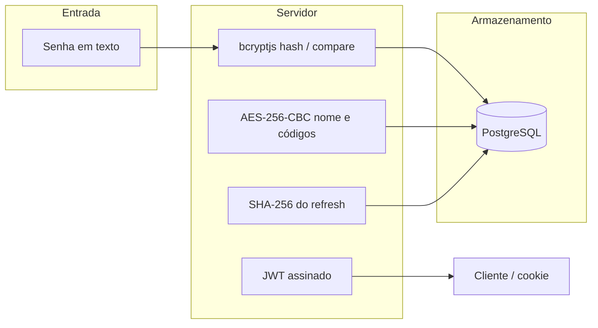

# Criptografia e escolha de dependências

Este documento resume **quais primitivas criptográficas** o projeto usa, **onde** aparecem no código e **por que** certas bibliotecas foram adotadas na API (`server`). O frontend (`app/web`) não aplica criptografia de domínio (senhas, tokens, campos no banco): ele apenas envia dados por HTTPS em produção e guarda o `accessToken` em memória, conforme o desenho da aplicação.

---

## Visão geral

| Objetivo | Mecanismo | Onde |
|----------|-----------|------|
| Armazenar senha com resistência a vazamento do banco | **bcrypt** (hash adaptativo + salt interno) | Cadastro, login, reset de senha |
| Proteger dados pessoais em repouso no PostgreSQL | **AES-256-CBC** (`node:crypto`), IV aleatório por valor | Nome do usuário e tokens em `access_code` |
| Autenticação stateless de curta duração | **JWT** assinado com segredo da aplicação | `@fastify/jwt` |
| Sessão prolongada sem expor refresh ao JavaScript | JWT em **cookie `httpOnly`** + apenas **hash SHA-256** do refresh no banco | `authenticate-access-code`, `sessions/refresh` |
| Integridade e boas práticas HTTP | **Helmet**, cookies com `secure` / `sameSite` em produção | `app.ts` |

---

## 1. Senhas: `bcryptjs`

### Uso

- **Hash** na criação de conta e na redefinição de senha (`bcrypt.hash`).
- **Verificação** no login (`bcrypt.compare`).
- Custo configurado em `BCRYPT_ROUNDS` (**10** em `server/src/config.ts`), equilíbrio usual entre custo computacional e UX em API web.

O salt e o fator de trabalho fazem parte do próprio string bcrypt; **não** é necessário armazenar salt em coluna separada.

### Por que a dependência `bcryptjs` (e não `bcrypt`)

- **`bcrypt`** (módulo nativo) depende de compilação (`node-gyp`) e de toolchain C++ no ambiente; falhas de build são comuns em Windows, WSL e pipelines minimalistas.
- **`bcryptjs`** é implementação em **JavaScript puro**, compatível com qualquer ambiente onde o Node roda, o que simplifica o projeto acadêmico e o CI.
- A API (`hash` / `compare` / rounds) é a mesma ideia do bcrypt clássico; o trade-off é **maior uso de CPU** por hash em relação ao nativo, aceitável para volumes moderados de registro/login.

---

## 2. Dados sensíveis em colunas: `node:crypto` (AES-256-CBC)

### Uso

O arquivo `server/src/utils/crypto.ts` define:

- Algoritmo **`aes-256-cbc`**.
- Chave derivada de **`ENCRYPTION_KEY`** em **hexadecimal** (32 bytes → 64 caracteres hex), carregada via `Buffer.from(..., 'hex')`.
- **IV aleatório de 16 bytes** por operação de cifra, concatenado ao ciphertext no formato `ivHex:cipherHex` antes de gravar no banco.

No schema Drizzle (`server/src/infra/database/schema.ts`), um tipo customizado (`encryptedText`) chama `encrypt` ao persistir e `decrypt` ao ler, aplicado a:

- **`users.name`** — dado pessoal identificável.
- **`access_code.token`** — códigos de 2FA e de recuperação de senha, para que um dump bruto da tabela não revele os códigos em claro.

### Por que `node:crypto` (built-in)

- Evita dependência externa para AES; API estável, auditada e mantida com o runtime.
- **Motivo do CBC**: implementação direta com `createCipheriv` / `createDecipheriv`; atende ao requisito de confidencialidade em repouso. Em evoluções futuras, **AES-256-GCM** poderia ser considerado para **confidencialidade + integridade** autenticada no mesmo passo (com tag); o projeto atual prioriza simplicidade e camada única de cifra.

**Operação**: a chave deve permanecer só em variável de ambiente no servidor; rotação de chave exigiria migração ou recifragem dos registros.

---

## 3. JWT: `@fastify/jwt`

### Uso

- **Access token**: payload mínimo (ex.: `sub` = id do usuário), expiração curta (**15 minutos**).
- **Refresh token**: inclui referência de sessão (`session`), expiração mais longa (**7 dias** no JWT; sessão no banco com outra janela conforme regra de negócio).

O segredo **`AUTHENTICATION_JWT_SECRET`** assina e valida os JWTs. Em `app.ts`, o plugin também associa o cookie nomeado `refreshToken` ao fluxo JWT.

### Por que `@fastify/jwt`

- Integração nativa com o ciclo de vida Fastify (`jwtSign`, `jwtVerify`, decode, opção `onlyCookie` para refresh).
- Por baixo dos panos usa ecossistema compatível com Fastify (ex.: **fast-jwt** no lockfile), com foco em desempenho e uso em API REST.

---

## 4. Hash do refresh token: `SHA-256` (`node:crypto`)

### Uso

Ao criar ou renovar sessão, o valor JWT do refresh é hasheado com **`createHash('sha256')`** e apenas o **hex** é guardado em `sessions.refresh_token_hash`. Na renovação, o cookie é hasheado de novo e comparado ao registro.

### Motivo

- **SHA-256** aqui não substitui bcrypt para senhas: serve como **função de digest** determinística para comparar token sem guardar o JWT completo no banco.
- Se o banco vazar, o atacante obtém hashes de refresh, não o token utilizável diretamente (ainda assim, proteger o banco e rotacionar segredos continua essencial).

---

## 5. Cookies: `@fastify/cookie`

### Uso

- Segredo **`AUTHENTICATION_COOKIE_SECRET`** para recursos de cookie da stack Fastify (assinatura/integração conforme configuração do plugin).
- Cookie `refreshToken`: **`httpOnly`**, **`secure`** em produção, **`sameSite`** `none` em produção (cenários cross-site, ex.: front e API em origens diferentes) e `lax` em desenvolvimento.

### Por que o plugin oficial

- Parsing e `setCookie` alinhados ao Fastify, mesma versão major que o restante dos plugins `@fastify/*`.

---

## 6. Cabeçalhos e superfície HTTP: `@fastify/helmet`

Envolve **Helmet** para cabeçalhos HTTP orientados a segurança. No projeto, `contentSecurityPolicy` está **desativada** para não quebrar a documentação Scalar em `/docs`; demais proteções do Helmet seguem ativas conforme a configuração padrão do plugin.

### Criptografia em trânsito (TLS)

A API documenta no `/health` que, em produção, o **TLS** deve terminar no **proxy reverso** ou via HTTPS nativo. Criptografia entre cliente e servidor na rede pública depende de HTTPS, não do código da aplicação em si.

---

## 7. O que o frontend não escolhe como dependência criptográfica

O `app/web` usa **Next.js** e envio de formulários para a API; não há `bcrypt` nem `crypto` de aplicação no bundle do usuário para senhas. Isso reduz superfície de ataque no browser e concentra políticas de hash, JWT e armazenamento no servidor.

---

## Tabela de dependências relacionadas à segurança (API)

| Pacote | Papel no projeto | Motivo da escolha |
|--------|------------------|-------------------|
| `bcryptjs` | Hash de senhas | Portabilidade, sem compilação nativa |
| `node:crypto` (built-in) | AES-256-CBC, SHA-256 | Sem dependência extra; controle explícito |
| `@fastify/jwt` | Assinatura e validação de JWT | Integração oficial Fastify |
| `@fastify/cookie` | Cookies httpOnly / opções de segurança | Integração oficial Fastify |
| `@fastify/helmet` | Cabeçalhos HTTP seguros | Padrão de mercado com Fastify |
| `fastify` + `dotenv` + `zod` | Servidor e validação de `ENCRYPTION_KEY`, segredos JWT/cookie | Validação de config evita subir API com segredos inválidos |

Variáveis de ambiente relevantes: `ENCRYPTION_KEY`, `AUTHENTICATION_JWT_SECRET`, `AUTHENTICATION_COOKIE_SECRET` (definidas em `server/src/environment-variables.ts`).

---

## Referências no código

- `server/src/utils/crypto.ts` — cifra simétrica.
- `server/src/infra/database/schema.ts` — tipo `encryptedText` em `name` e `token`.
- `server/src/infra/http/routes/v1/users/register.ts`, `reset-password.ts`, `authenticate-with-password.ts` — bcrypt.
- `server/src/infra/http/routes/v1/auth/authenticate-access-code.ts`, `sessions/refresh-token.ts` — JWT + SHA-256 do refresh.
- `server/src/infra/http/app.ts` — JWT, cookie, Helmet.
