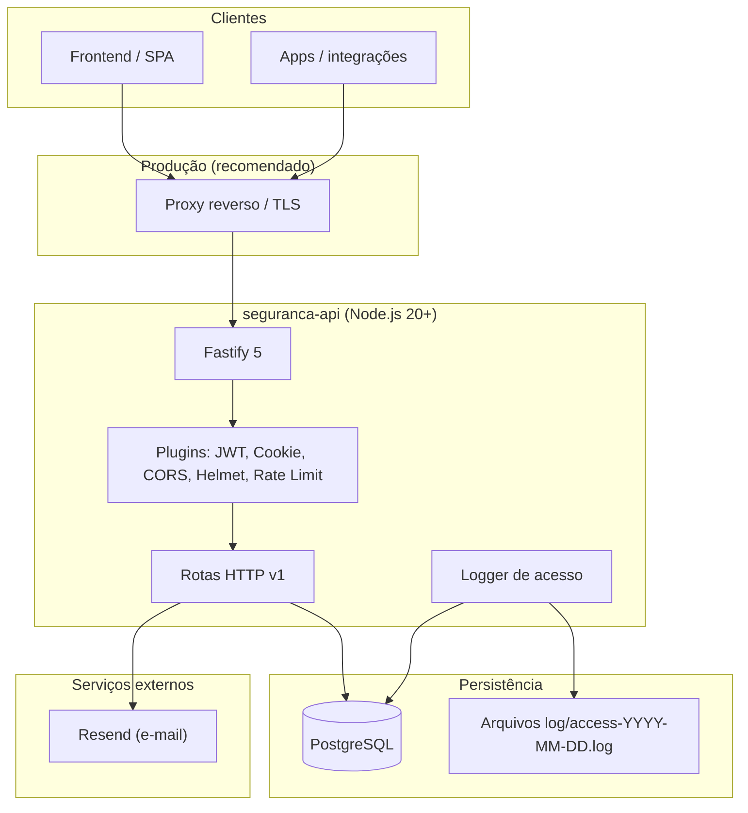
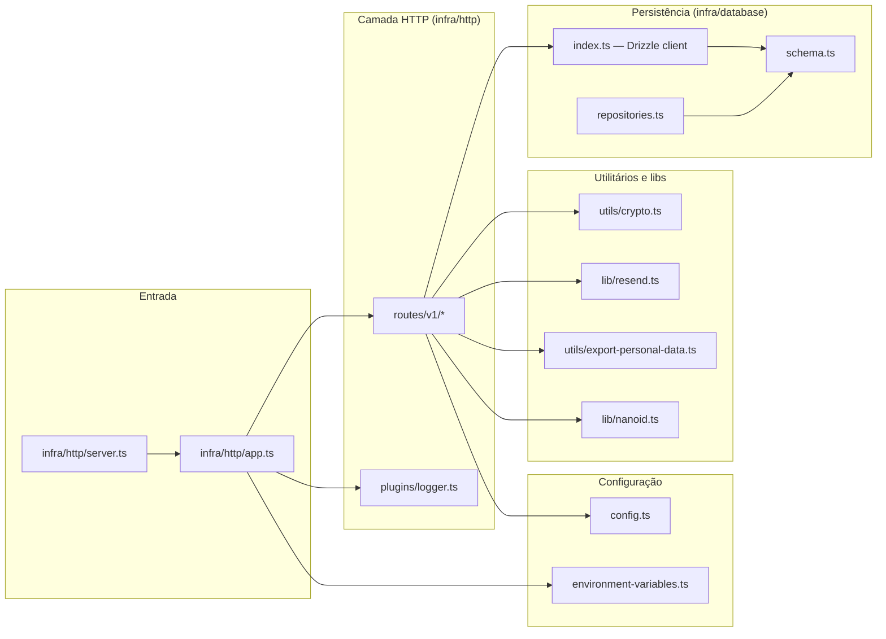
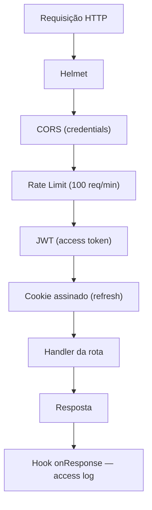
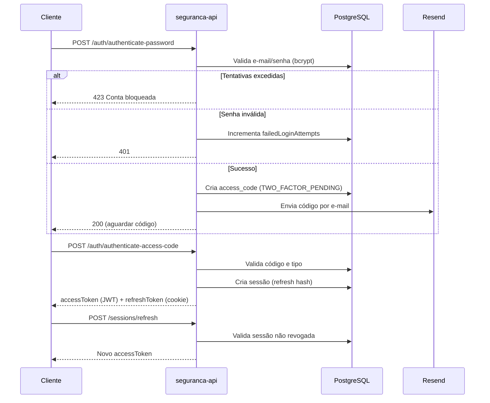
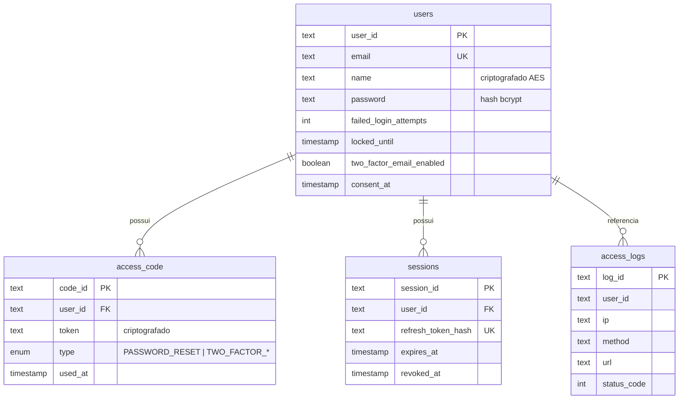
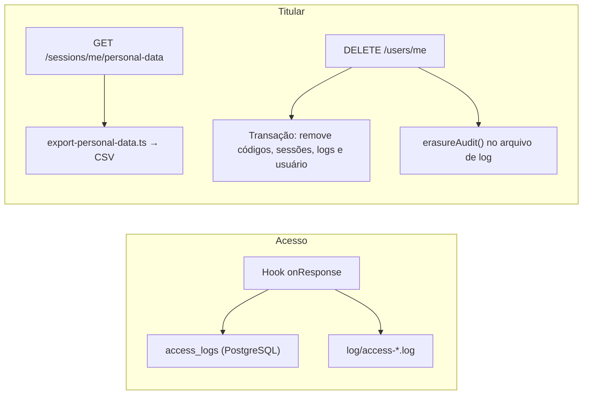
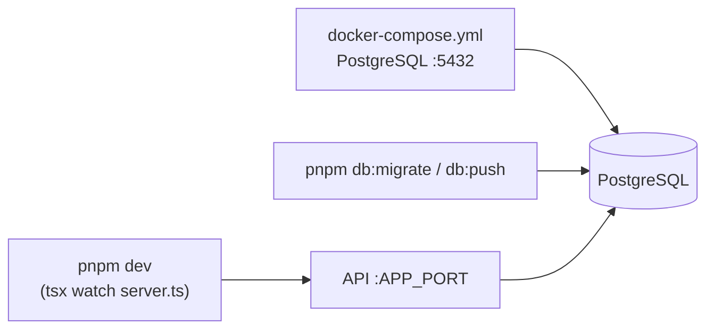

# Arquitetura — seguranca-api

API de autenticação e gestão de identidade do projeto **UMC Segurança**. Responsável por cadastro, login (senha + 2FA por e-mail), sessões JWT, recuperação de senha e direitos do titular (LGPD).

## Visão geral



## Camadas do código

Organização em pastas sob `src/`:



| Camada | Responsabilidade |
|--------|------------------|
| `infra/http` | Servidor Fastify, registro de plugins, rotas e documentação OpenAPI |
| `infra/database` | Schema Drizzle, conexão PostgreSQL e aliases de repositório |
| `utils` / `lib` | Criptografia de PII, exportação LGPD, IDs e envio de e-mail |
| `config` / `environment-variables` | Constantes de negócio e validação de variáveis de ambiente (Zod) |

## Stack tecnológica

| Componente | Tecnologia |
|------------|------------|
| Runtime | Node.js ≥ 20 |
| Framework HTTP | Fastify 5 |
| Validação / contratos | Zod + fastify-type-provider-zod |
| ORM | Drizzle ORM |
| Banco | PostgreSQL (`pg` / `postgres`) |
| Autenticação | `@fastify/jwt` + `@fastify/cookie` |
| Senhas | bcryptjs |
| Dados sensíveis em repouso | AES-256-CBC (`ENCRYPTION_KEY`) |
| E-mail transacional | Resend |
| Documentação | Swagger + Scalar (`/docs`) |
| Build | tsup → `dist/index.js` |

## Plugins e segurança HTTP



## Endpoints principais

| Método | Rota | Descrição |
|--------|------|-----------|
| `GET` | `/health` | Health check |
| `GET` | `/docs` | Referência da API (Scalar) |
| `POST` | `/users` | Cadastro de usuário |
| `POST` | `/auth/authenticate-password` | Login com e-mail e senha (inicia 2FA) |
| `POST` | `/auth/authenticate-access-code` | Valida código e emite tokens |
| `POST` | `/sessions/refresh` | Renova access token via refresh cookie |
| `POST` | `/logout` | Revoga sessão |
| `POST` | `/password/forgot` | Solicita reset de senha |
| `POST` | `/password/reset` | Redefine senha com token |
| `GET` | `/sessions/me` | Perfil do usuário autenticado |
| `GET` | `/sessions/me/personal-data` | Exportação de dados (LGPD) |
| `DELETE` | `/users/me` | Exclusão de conta (LGPD) |

## Fluxo de autenticação (2FA por e-mail)



## Modelo de dados



## Auditoria e LGPD



## Variáveis de ambiente

| Variável | Uso |
|----------|-----|
| `DATABASE_URL` | Conexão PostgreSQL |
| `APP_PUBLIC_URL` | Links em e-mails (reset, etc.) |
| `APP_PORT` / `APP_HOST` | Bind do servidor |
| `ENCRYPTION_KEY` | Chave hex para AES (nome do usuário) |
| `AUTHENTICATION_JWT_SECRET` | Assinatura do access token |
| `AUTHENTICATION_COOKIE_SECRET` | Cookies assinados |
| `RESEND_API_KEY` | API de e-mail |
| `ACCESS_LOG_DIR` | Diretório dos logs de acesso (opcional, padrão `log`) |

## Implantação local



1. Subir o banco: `docker compose up -d` (pasta `server/`).
2. Configurar `.env` conforme `environment-variables.ts`.
3. Aplicar migrações: `pnpm db:migrate`.
4. Desenvolvimento: `pnpm dev` — produção: `pnpm build` + `pnpm start`.

## Estrutura de diretórios

```
server/
├── src/
│   ├── config.ts
│   ├── environment-variables.ts
│   ├── infra/
│   │   ├── database/
│   │   │   ├── index.ts          # Cliente Drizzle
│   │   │   ├── schema.ts         # Tabelas e tipos
│   │   │   └── repositories.ts
│   │   └── http/
│   │       ├── app.ts            # Composição Fastify
│   │       ├── server.ts         # Entry point
│   │       ├── plugins/
│   │       │   └── logger.ts
│   │       └── routes/v1/
│   │           ├── auth/
│   │           ├── sessions/
│   │           └── users/
│   ├── lib/
│   │   ├── nanoid.ts
│   │   └── resend.ts
│   └── utils/
│       ├── crypto.ts
│       └── export-personal-data.ts
├── docker-compose.yml
├── drizzle.config.*              # Migrações Drizzle Kit
├── tsup.config.ts
└── dist/                         # Bundle de produção
```

---

*Documento gerado com base na estrutura e no código do repositório `seguranca-api`.*
